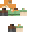

# Soruces
 (steve.png) from [http://assets.mojang.com/SkinTemplates/steve.png](https://web.archive.org/web/20200225145927/http://assets.mojang.com/SkinTemplates/steve.png)

 (alex.png) from [http://assets.mojang.com/SkinTemplates/alex.png](https://web.archive.org/web/20200225145858/http://assets.mojang.com/SkinTemplates/alex.png)

[yggdrasil_session_pubkey.pem](./yggdrasil_session_pubkey.pem) extracted from [Mojang-authlib](https://repo.moep.tv/com/mojang/authlib/)

Content inside [rendering_models](./rendering_models) created with [BlockBench.net](https://blockbench.net/)
